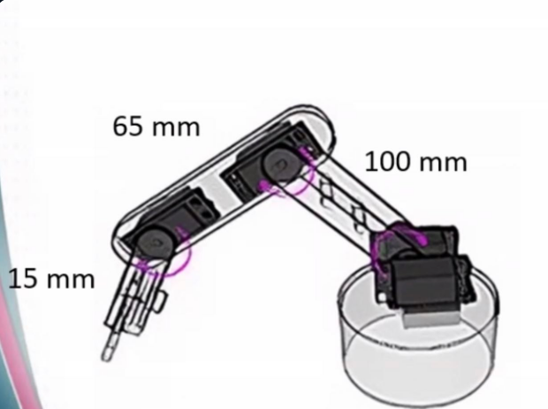

# Forward Kinematics for 4-DOF Robotic Arm

## Task

The following schematic represents a 4-DOF robotic arm. The required task is to derive the Forward Kinematics equations and calculate the position of the end-effector in 3D space (x, y, z).

## Robotic Arm Specifications

Based on the provided schematic:

- **Link 1 (L1):** 100 mm
- **Link 2 (L2):** 65 mm
- **End-Effector Offset:** 15 mm
- **Base Height:** H

## Joint Angles

- **θ1:** Base rotation angle
- **θ2:** Shoulder joint angle
- **θ3:** Elbow joint angle

## Forward Kinematics Equations

The position of the end-effector is calculated using the following equations.

### X-coordinate

\[
x =
[100cos(\theta_2)+65cos(\theta_2+\theta_3)]
cos(\theta_1)
\]

### Y-coordinate

\[
y =
[100cos(\theta_2)+65cos(\theta_2+\theta_3)]
sin(\theta_1)
\]

### Z-coordinate

Considering the base height:

\[
z =
H+100sin(\theta_2)+65sin(\theta_2+\theta_3)+15
\]

## Final Position

The end-effector position is:

\[
P=
\begin{bmatrix}
x\\
y\\
z
\end{bmatrix}
\]

## Notes

- The base height (H) is included to account for the robotic arm base position.
- The 15 mm end-effector offset is added according to the schematic.
- The angles should be converted to radians before using sin() and cos() functions in programming languages such as Python or C++.
- Although the robotic arm has 4 DOF, this model calculates the position (x, y, z) using the three joints that affect the end-effector position. The fourth joint is considered for orientation only.
